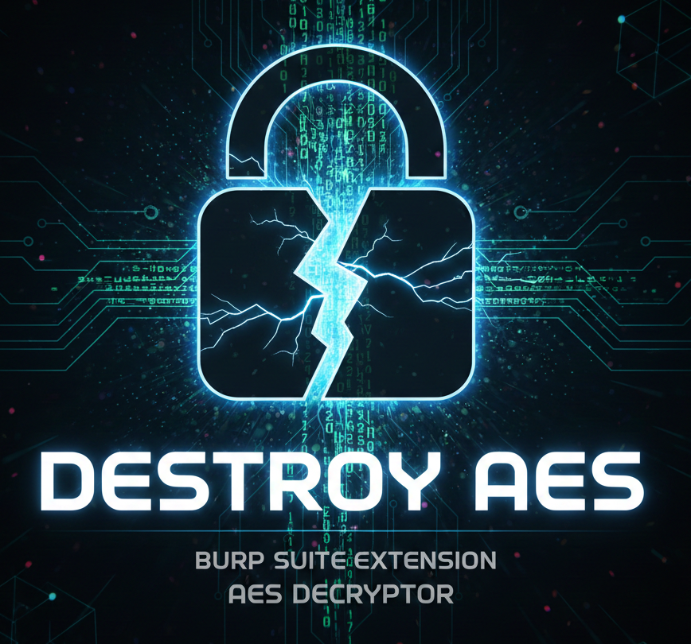

# Destroy AES



A powerful Burp Suite extension for automatically decrypting and encrypting AES-encrypted HTTP requests and responses. Perfect for security audits and penetration testing of applications using AES encryption.

## 🎯 Features

- **Automatic Decryption**: Decrypts AES-encrypted data in intercepted requests and responses
- **Automatic Encryption**: Re-encrypts data before sending to the server
- **JSON Parsing**: Automatically parses and formats JSON data for better readability
- **Multiple AES Modes**: Supports CBC, ECB, and GCM modes
- **Flexible Padding**: Supports PKCS5, PKCS7, and NoPadding
- **Key Sizes**: Supports 128, 192, and 256-bit keys
- **Context Menu**: Manual encrypt/decrypt options via right-click menu
- **Real-time Processing**: Works seamlessly in Burp Suite Proxy Intercept

## 📋 Requirements

### System Requirements

- **Burp Suite**: Professional or Community Edition (2023.12.1 or later)
- **Java**: JDK 11 or higher
- **Maven**: 3.6.0 or higher (for building from source)

### Dependencies

The extension uses the following dependencies (automatically managed by Maven):

- **Burp Suite Montoya API**: `2023.12.1` (provided by Burp Suite)
- **Bouncy Castle**: `1.70` (for advanced cryptographic operations)
- **Gson**: `2.10.1` (for JSON parsing)

## 🚀 Installation

### Option 1: Using Pre-built JAR

1. Download the latest `destroy-aes-1.0.0.jar` from the [Releases](../../releases) page
2. Open Burp Suite
3. Go to **Extensions** → **Installed** → **Add**
4. Select **Extension type**: Java
5. Click **Select file** and choose `destroy-aes-1.0.0.jar`
6. Click **Next** and verify the extension loads successfully

### Option 2: Building from Source

1. Clone the repository:
   ```bash
   git clone https://github.com/engelberth90/Destroy-AES.git
   cd destroy-aes
   ```

2. Build the project:
   ```bash
   mvn clean package
   ```

3. The JAR file will be generated in `target/destroy-aes-1.0.0.jar`

4. Load the JAR in Burp Suite following the steps in Option 1

## ⚙️ Configuration

1. After loading the extension, go to the **Destroy AES** tab in Burp Suite
2. Configure the following settings:

### Encryption Settings

- **Mode**: Select AES mode (CBC, ECB, or GCM)
- **Padding**: Choose padding scheme (PKCS5Padding, PKCS7Padding, or NoPadding)
- **Key Size**: Select key size (128, 192, or 256 bits)
- **Data Format**: Choose data format (JSON, RAW, or FORM)

### Keys and Vectors

- **Key (Base64)**: Enter your AES key in Base64 format
  - Click **Generate** to create a random key
- **IV (Base64)**: Enter your initialization vector in Base64 format
  - Click **Generate** to create a random IV
  - Note: IV is not required for ECB mode

### Parameters

- **Request Parameter**: JSON field name containing encrypted request data (e.g., `payload`, `data`, `encryptedData`)
- **Response Parameter**: JSON field name containing encrypted response data

### Options

- ☑ **Extension Enabled**: Enable/disable the extension
- ☑ **Decrypt Requests**: Automatically decrypt intercepted requests
- ☑ **Decrypt Responses**: Automatically decrypt server responses
- ☑ **Auto-encrypt on modify**: Automatically encrypt data before sending

3. Click **💾 Save Configuration** to save your settings
4. Click **🧪 Test Configuration** to verify your setup works correctly

## 🔄 How It Works

### Workflow

1. **Intercept Request**: When you intercept a request in Burp Suite Proxy
   - The extension automatically decrypts the encrypted data
   - JSON data is parsed and formatted for readability
   - You see the decrypted, human-readable data

2. **Modify Data**: Edit the decrypted data as needed
   - Change values, add fields, modify JSON structure
   - The extension tracks your changes

3. **Forward Request**: When you click Forward
   - The extension automatically encrypts the modified data
   - The server receives properly encrypted data
   - No errors, seamless operation

4. **Response Handling**: Server responses are automatically decrypted
   - You see decrypted responses in Burp Suite
   - JSON is parsed and formatted automatically

### Example

**Original Request (Encrypted):**
```json
{
  "payload": "U2FsdGVkX1+vupppZksvRf5pq5g5XkFy..."
}
```

**After Intercept (Decrypted):**
```json
{
  "payload": {
    "username": "admin",
    "password": "secret123"
  }
}
```

**After Forward (Re-encrypted):**
```json
{
  "payload": "U2FsdGVkX1+vupppZksvRf5pq5g5XkFy..."
}
```

## 🎨 Features in Detail

### Automatic JSON Parsing

The extension automatically detects and parses JSON data after decryption:
- If decrypted data is valid JSON, it's parsed as a JSON object
- If not JSON, it remains as a plain string
- This makes the data much more readable in Burp Suite

### Context Menu Integration

Right-click on any request/response in Burp Suite to access:
- **Decrypt with AES Master**: Manually decrypt selected data
- **Encrypt with AES Master**: Manually encrypt selected data

### Multiple AES Modes

- **CBC (Cipher Block Chaining)**: Most common mode, requires IV
- **ECB (Electronic Codebook)**: Simple mode, no IV required (less secure)
- **GCM (Galois/Counter Mode)**: Authenticated encryption, requires IV

### Flexible Configuration

- Generate random keys and IVs with one click
- Test your configuration before using it
- Save and load configurations easily

## 🛠️ Troubleshooting

### Extension Not Loading

- Verify you're using Burp Suite 2023.12.1 or later
- Check that Java 11+ is installed
- Review the **Extensions** → **Errors** tab for error messages

### Decryption Not Working

- Verify your key and IV are correct (Base64 format)
- Ensure the key size matches your configuration
- Check that the parameter names match your application
- Use **Test Configuration** to verify settings

### JSON Not Parsing

- Ensure the decrypted data is valid JSON
- Check that the data format is set to "JSON"
- Verify the parameter name is correct

### Server Errors After Forward

- Ensure "Auto-encrypt on modify" is enabled
- Verify your encryption settings match the server's expectations
- Check the extension logs in **Extensions** → **Output**

## 📝 Logs

Check the extension logs in Burp Suite:
- Go to **Extensions** → **Destroy AES** → **Output**
- Look for messages like:
  - `[PROXY REQUEST] Descifrado para visualización`
  - `[HTTP] Request cifrado antes de enviar al servidor`
  - `[PROXY] Request descifrado y parseado como JSON`

## 🔒 Security Note

This extension is designed for security testing and auditing purposes only. Use responsibly and only on systems you own or have explicit permission to test.

## 🤝 Contributing

Contributions are welcome! Please feel free to submit a Pull Request.

## 📧 Support

For issues, questions, or feature requests, please open an issue on GitHub.

---

**Made for offensive security professionals** 🔥

